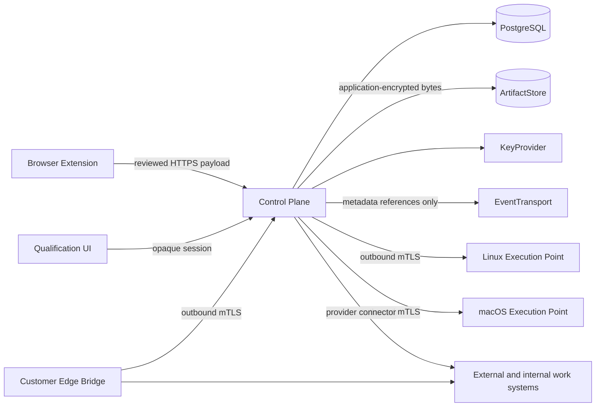

# Libre AI Signalement — Foundation Specification

**Status:** locally accepted foundation; product capabilities remain unimplemented and unqualified.

## Product statement

Libre AI Signalement lets a collaborator capture an incident or improvement request,
review the exact evidence that may leave the browser, publish portable projections
to one or more work-management systems, reproduce the observed behavior, and attach
deterministic verification results to every selected target.

The product is not a ticket tracker. A Dossier is the canonical evidence-bearing
record; Jira, GitHub, GitLab, Linear, Plane, internal tools, and other systems hold
external projections of that record.

The product has no standalone promise or identity: public communication remains under
the Libre AI family promise. Capability language is derived from verified project state,
never from a product tagline.

## Outcomes

1. A non-technical collaborator can prepare and review a complete report without
   exposing undeclared page content.
2. A developer can turn the approved report into a versioned executable scenario.
3. The same scenario can reproduce a defect and verify a correction without changing
   its assertions silently.
4. One Dossier can be projected to several external systems with independent,
   idempotent delivery state.
5. Reports, evidence, scenarios, and results remain exportable without the service.

## Non-goals

- Replacing Jira, Linear, Plane, or an enterprise work-item authority.
- Treating a successful click sequence as proof of correction.
- Capturing audio, request bodies, response bodies, cookies, or authentication headers
  by default.
- Replaying captured user sessions or cookies.
- Giving an AI model authority to change assertions, publish content, resolve conflicts,
  or execute side effects.
- Claiming support for a browser, provider, or deployment profile that has not passed
  its exact qualification suite.
- Receiving suspected vulnerabilities, exposed secrets, or exploit details through a
  Dossier; those use the fleet `SECURITY.md` private channel.

## Canonical model

- `Dossier`: user statement, observed facts, approved evidence, impact, and expectations.
- `CaptureSession`: voluntary, bounded collection interval.
- `Artifact`: immutable encrypted bytes with digest, provenance, classification, and
  redaction lineage.
- `Scenario`: immutable version of preconditions, actions, assertions, preparation,
  cleanup, and declared side effects.
- `Execution`: one attempt against an exact environment and capability set.
- `Verdict`: deterministic result derived from evaluated assertions and execution state.
- `FederationGroup`: selected external destinations for one Dossier.
- `ExternalProjection`: target-specific identifier, field mapping, authority rules,
  delivery cursor, and synchronization state.

Canonical public contracts live in `libre-ai/contracts`. Any copy in this repository
is a generated, SHA-pinned projection guarded byte-for-byte against drift.

## System boundaries



### Trust boundaries

- Browser pages, tickets, comments, attachments, provider responses, and model outputs
  are untrusted data and never authorized instructions.
- Raw artifacts never transit through the event transport.
- Execution points are untrusted until their signed capabilities match the requested
  browser, version, operating system, viewport, and isolation profile exactly.
- Connectors and the Customer Edge Bridge are explicit disclosure boundaries. Every
  target receives a separately approved projection.
- A restored deployment starts with external effects disabled.

### Sensitive flows

- Browser capture to local quarantine before explicit review.
- Target-bound disclosure from the approved Dossier to each connector.
- Envelope-encrypted artifact upload and later decryption through `KeyProvider`.
- Secrets injected only into an authorized execution, never stored in a Scenario.

### Responsibilities

- Extensions capture only within active permissions and display partial-capture limits.
- The web UI qualifies, redacts, approves, and removes evidence.
- The control plane owns canonical state, audit receipts, outbox intents, and policy.
- Workers execute immutable Scenarios and return evidence; they do not decide verdicts.
- Connectors translate canonical projections and expose unsupported capabilities.

### Critical dependencies

- PostgreSQL is the state authority and baseline transactional transport.
- POSIX and minimal S3-compatible `ArtifactStore` implementations are required.
- Playwright and W3C WebDriver are compilation targets of the canonical Scenario IR.
- Real Safari requires a qualified macOS execution point on Apple hardware.

### Unverified assumptions

- Exact Safari extension and `safaridriver` capabilities remain `unverified` until the
  real-device qualification matrix passes.
- Each provider edition and API version remains `catalogued`, not `supported`, until a
  live create, attach, resume, update, and conflict suite passes.
- Clever Cloud data location, subprocessors, and recovery guarantees require contractual
  evidence before production data is authorized.

## Repository topology

The repository owns one Bun workspace and one Cargo workspace. Files that implement a
single product remain together; reusable contracts stay in their existing authorities.

```text
apps/
  web/                 Dossier review and qualification UI
  api/                 HTTP boundary and modular control plane
  extension-chrome/    Chromium packaging and browser-specific adapter
  extension-firefox/   Firefox packaging and browser-specific adapter
  extension-safari/    Safari Web Extension packaging and native host boundary
packages/
  domain/              Canonical internal domain behavior
  capture-core/        Browser-neutral capture and redaction policy
  connector-sdk/       Apache-2.0 provider boundary
  scenario-ir/         Internal projection of locked Scenario contracts
connectors/            Provider adapters with independent capability manifests
crates/                Security-, proof-, and execution-sensitive Rust components
workers/               Linux and macOS execution-point implementations
contracts/             Generated locked-contract projections only
qualification/         Versioned assumptions, risks, matrices, and decisions
deploy/                Portable self-hosted and Clever EU profiles
tests/                 Cross-boundary contract, integration, and end-to-end suites
tools/agent/            Repository-native work-package orchestrator
```

## Bootstrap acceptance

The sealed repository is eligible for first publication only when:

1. The product name has been signed into the governance LEXICON.
2. The repository contains no captured page, ticket, credential, personal email, or
   organization instance data.
3. A red/green public-boundary proof demonstrates rejection of a synthetic leak and
   acceptance after its removal.
4. A public-history gate refuses unexpected refs and inspects every reachable Git
   object, commit identity/message and annotated-tag identity/message without path
   exclusions.
5. `project.v1.yaml` validates against the pinned governance schema.
6. Licensing is machine-readable: EUPL-1.2 for first-party network runtime,
   Apache-2.0 for connector adoption boundaries, and CC-BY-4.0 for editorial docs.
7. The complete local gate is green without requiring provider credentials.
8. Every capability is honestly labelled `specified`, `catalogued`, `unverified`, or
   `verified`; no integration is presented as operational.
9. ADR-0038/I-30 is followed: exact OIDs are pushed first to an empty private remote,
   reproduced from a complete private clone, and attested in Governance before any
   separate public-visibility action.
